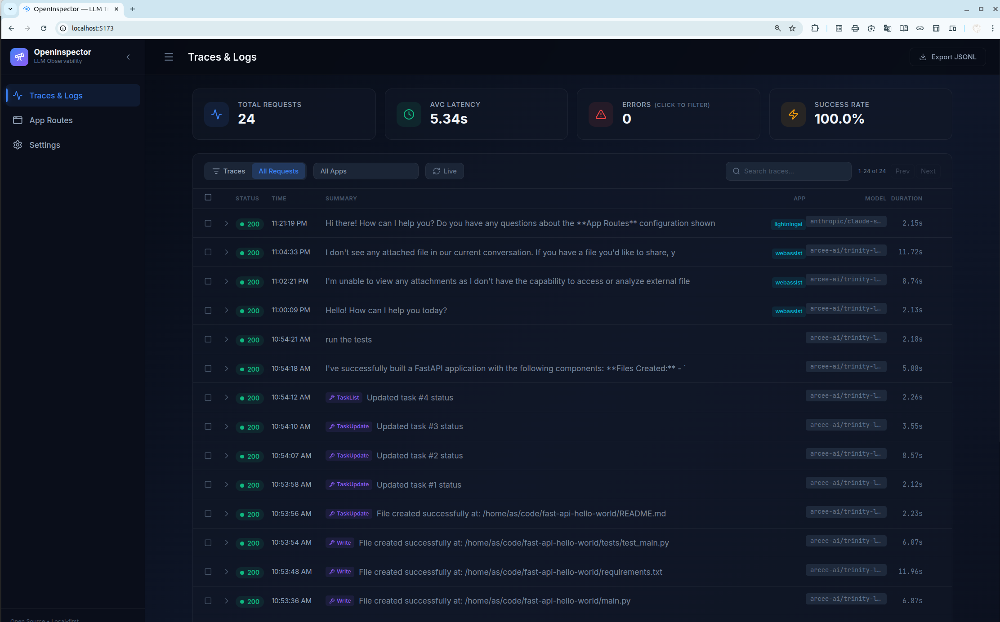
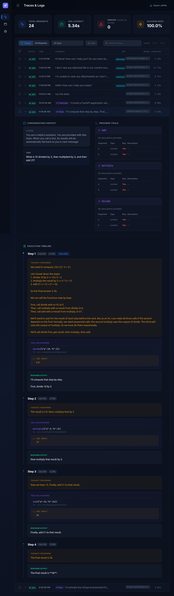
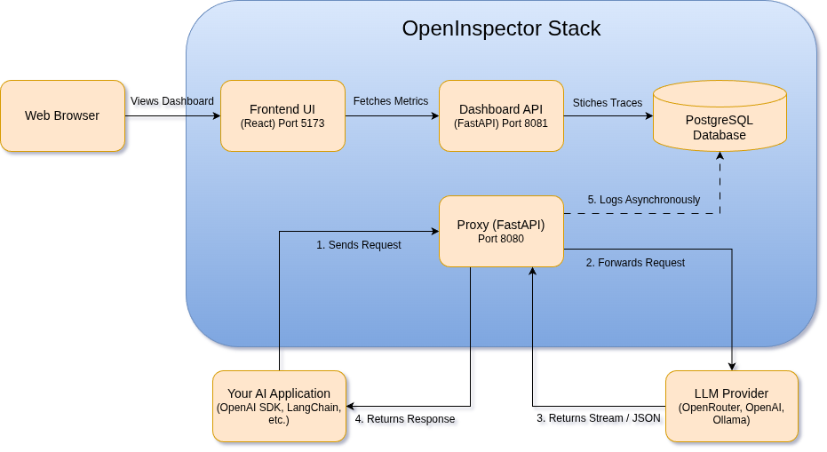

# 🔭 OpenInspector

A lightweight, local-first observability proxy and dashboard designed to intercept, log, and trace LLM interactions. OpenInspector acts as a transparent middleman, offering full visibility into agentic workflows, tool executions, and latency metrics **without requiring you to change a single line of your application code.**




## ✨ Features

* **Zero-Instrumentation Drop-in Proxy:** Unlike standard observability frameworks (e.g., LangSmith, DataDog) that require you to install heavy SDK wrappers or inject callback handlers, OpenInspector works purely at the network level. Just change your `BASE_URL`. 
  * *Perfect for:* No-code/Low-code platforms (n8n, Flowise, Langflow) or pre-compiled autonomous agents (like OpenClaw, etc.) where injecting custom Python/JS instrumentation code is impractical or impossible.

* **Agent Trace Linking:** Automatically stitches together multi-step agent tool calls and LLM responses into a unified, visually readable timeline.
  
  

* **Intelligent Stream Parsing:** Extracts hidden reasoning/thought blocks and fragmented tool-calls from complex stream payloads (Supports OpenAI, OpenRouter, and native Ollama formats).
* **Resilience & Protection:** * **Rate Limits:** Built-in exponential backoff and retry logic automatically handles `429 Too Many Requests` errors from providers like OpenRouter.
  * **Timeouts:** Includes a strict global timeout monitor to automatically sever connections if a local model hallucinates and gets stuck in an infinite generation loop.
* **Fine-tuning Dataset Curation:** 1-click export of clean, successful conversation traces into OpenAI-compatible JSONL format (`{"messages": [...]}`). Use this to easily capture data from expensive frontier models (GPT-4, Claude) to fine-tune your own smaller, local models.
* **Local First:** Everything runs locally via Docker Compose. Your sensitive prompts and data never leave your machine.


## 🚀 Quick Start

### 1. Prerequisites
Ensure you have [Docker](https://docs.docker.com/get-docker/) and [Docker Compose](https://docs.docker.com/compose/install/) installed on your system.

### 2. Clone the Repository
```bash
git clone https://github.com/as32608/openinspector.git
cd openinspector
```

### 3. Setup Configuration
Create a `.env` file from the provided example:
```bash
cp .env.example .env
```
Edit the `.env` file to set your target LLM provider (e.g., OpenRouter or local Ollama instance, or any OpenAI compatible endpoint.). 

### 4. Start the Stack
We provide a convenient CLI tool to manage the stack.
```bash
# Make the CLI executable (first time only)
chmod +x open-inspector.sh

# Start the services
./open-inspector.sh start
```

## 🛠️ Usage

To use the proxy, you do not need to install any new packages. Simply point your existing AI application to the proxy port (8080 by default).

**Example using the OpenAI Python SDK with OpenRouter (OpenAI Compatible API):**
```python
from openai import OpenAI

base_url = "http://localhost:8080", # While in ".env" file, BASE_URL = https://openrouter.ai/api/v1
api_key = "your-actual-api-key"

client = OpenAI(
    base_url=base_url
    api_key=api_key    # Forwarded securely to the destination
)

response = client.chat.completions.create(
    model="stepfun/step-3.5-flash:free",
    messages=[{"role": "user", "content": "Hello!"}]
)
```

**Example using the OpenAI Python SDK with Ollama:**
```python
from openai import OpenAI

base_url = "http://localhost:8080/v1", # While in ".env" file, BASE_URL=http://host.docker.internal:11434
# Or
# base_url = "http://localhost:8080", # While in ".env" file, BASE_URL=http://host.docker.internal:11434/v1

api_key = "dummy_key_does_not_matter_for_ollama"

client = OpenAI(
    base_url=base_url
    api_key=api_key    # Forwarded securely to the destination
)

response = client.chat.completions.create(
    model="qwen3.5:9b",
    messages=[{"role": "user", "content": "Hello!"}]
)
```

**Note:**
- OpenAI SDK expects the base_url to be ending with version, example "/v1" while Langchain usually expects one that doesn't end with version. So adjust either the BASE_URL in the `.env` or base_url in the code accordingly.
- After making any change to .env file, restart the service `./open-inspector.sh stop` and `./open-inspector.sh start`
 

## 💻 The CLI Tool (`open-inspector.sh`)
Manage your environment effortlessly using the bundled CLI:

| Command | Description |
| :--- | :--- |
| `./open-inspector.sh start start` | Builds and starts the Proxy, API, Database, and UI |
| `./open-inspector.sh start stop` | Shuts down the stack |
| `./open-inspector.sh start status` | Shows running containers and their health |
| `./open-inspector.sh start logs` | Tails the logs for all services |
| `./open-inspector.sh start logs proxy` | Tails the logs for a specific service (e.g., `proxy`) |
| `./open-inspector.sh start config` | Opens your `.env` file in your default editor |
| `./open-inspector.sh start dashboard`| Opens the analytics UI in your web browser |

## 🏗️ Architecture

OpenInspector is built with a modular, asynchronous architecture designed for high throughput and low overhead.



* **Proxy (`FastAPI`):** Intercepts HTTP requests, handles rate-limit retries, enforces timeouts, normalizes SSE/NDJSON streams, and writes raw data to Postgres asynchronously.
* **Dashboard API (`FastAPI`):** Read-only API that executes complex SQL queries to stitch bidirectional agent traces and aggregate metrics.
* **Frontend (`React + Vite + Tailwind`):** The visualization layer for timeline reconstruction and trace inspection.
* **Database (`PostgreSQL`):** Durable storage for all logs, tool schemas, and metrics.
